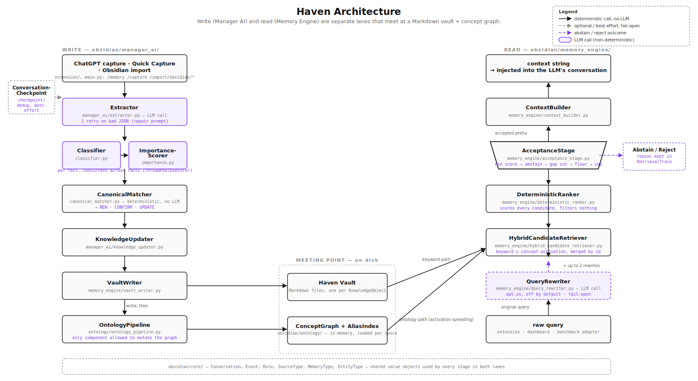
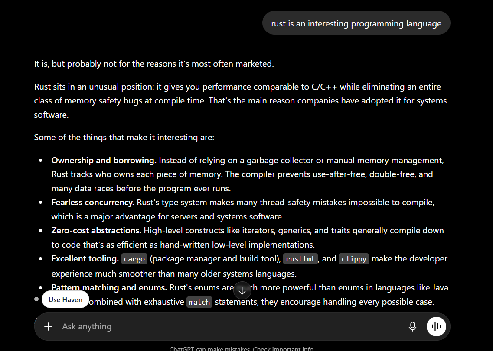

<div align="center">

<!-- VISUAL — wordmark.svg · obsidian/docs/media/wordmark.svg
     A quiet, text-first wordmark: "Haven" in a humanist serif or geometric sans,
     with the "a" subtly enclosed in a rounded square (a vault door). Monochrome,
     works on dark and light GitHub themes. No mascot, no gradient, no glow.
     First thing the viewer notices: restraint. It should look like infrastructure.
     TODO: uncomment once obsidian/docs/media/wordmark.svg exists —
      -->

# Haven

### Memory for AI that can show its work.

Haven is a local-first memory system for LLMs that can explain — for every single
memory it retrieves — **why it matched, why it ranked where it did, and why it was
accepted or rejected.** No hidden scoring. No embedding roulette. Every answer comes
with a receipt.

[](LICENSE)


**[Quick start](#-quick-start-5-minutes-no-api-key)** ·
**[How it works](#-how-it-works)** ·
**[Benchmarks](#-benchmarks)** ·
**[Live inspectors](#-the-inspection-suite)** ·
**[Roadmap](#-roadmap)**

</div>

<!-- VISUAL — hero.gif · obsidian/docs/media/hero.gif · ~25s loop, 1280px wide, placed here,
     immediately after the fold. This is the single most important asset in the README.

     Three beats, ~8s each, with 1-word title cards between them:

     Beat 1 — "REMEMBER": ChatGPT open. User finishes a conversation about choosing
     Postgres for a billing service, clicks Haven's "Remember" button next to the
     reply. A toast confirms the save.

     Beat 2 — "RETRIEVE": A fresh ChatGPT conversation days later. User types
     "what did I decide for the billing service database?", clicks "Use Haven"
     near the compose box, and the retrieved memory context visibly appears in
     the prompt before sending.

     Beat 3 — "EXPLAIN": Cut to the Haven dashboard's Retrieval Inspector showing
     that same query — the ranked candidates with their score-breakdown bars
     (activation, keyword overlap, confidence, recency) and one candidate marked
     REJECTED with its reason.

     What the viewer should notice first: the score breakdown in beat 3. Every
     other memory tool can do beats 1–2. Only Haven has beat 3 — the GIF exists
     to make that contrast land without a single sentence of copy.
     TODO: uncomment once obsidian/docs/media/hero.gif exists —
      -->

---

## Why this exists

Every AI memory system makes the same promise: *your assistant will remember you.*
Then you ask it something, it injects three irrelevant memories and misses the one
that mattered, and you have **no way to find out why.** The embedding said so. The
end.

That black box is fine for a demo. It's disqualifying for a second brain — a system
you're supposed to trust with years of your decisions, preferences, and projects.
Trust requires the ability to audit.

Haven is built on a fork of [mem0](https://github.com/mem0ai/mem0) around one
uncompromising idea:

> **A memory system you can't interrogate is a memory system you can't trust.**
> So every stage of Haven's pipeline is deterministic, traceable, and inspectable —
> and the correctness of no stage depends on an LLM behaving a particular way at
> runtime.

Three headline results, each measured against the mem0 baseline on the same cases
and unpacked with full methodology in [Benchmarks](#-benchmarks):

| | Baseline | Haven | |
|---|---:|---:|---|
| **Retrieval precision** | 0.301 | **0.679** | 2.3× more of what's returned is relevant |
| **False-positive rate** | 0.500 | **0.100** | 5× fewer junk memories injected |
| **Accepted candidates** | 278 | **110** | 60% less noise, at ~0 ms added latency |

And on the write side: re-sending an unchanged conversation costs **zero LLM
calls** (the baseline pays 3 per send), and at 500 conversation turns Haven's
extraction prompt is **~769 est. tokens vs ~6,800** — constant-size, where the
baseline grows linearly forever.

---

## What makes Haven different

**🎯 Deterministic retrieval.** The read path is plain, testable Python: keyword
matching with IDF-weighted overlap, activation spreading across a concept graph,
and a ranker that scores every candidate on named, inspectable factors. Same vault,
same query → same answer, every time. No temperature, no vibes.

**🔍 Explainable by construction — not as a feature.** Explanation isn't a log
bolted on afterward; the pipeline's own data structures carry a score breakdown and
acceptance decision for every candidate, surfaced live in three built-in
inspectors ([see below](#-the-inspection-suite)).

**🛑 A memory system that can say "I don't know."** Haven's acceptance stage runs
five deterministic checks after ranking — minimum score, abstention, score-gap
detection, relative threshold, hard cap — and will return *nothing* rather than
pad your prompt with weak matches. This one stage is where most of the
false-positive reduction comes from.

**📁 Your memories are files, not rows.** Every memory is a Markdown file with
YAML frontmatter in a folder you choose — openable as an [Obsidian](https://obsidian.md)
vault, greppable, diffable, syncable, yours. Delete Haven tomorrow and your second
brain is still sitting there in plain text.

**⚡ Never pays for the same conversation twice.** Conversation checkpoints
fingerprint what's already been ingested. Unchanged conversation → short-circuit
before the pipeline even runs. One new turn → only that turn is processed, against
a compact retrieved background instead of the full transcript.
([Details](#-never-ingest-the-same-conversation-twice).)

### How that compares

| | Typical embedding memory | **Haven** |
|---|---|---|
| Retrieval | Vector similarity, opaque | Hybrid keyword + concept-graph activation, deterministic |
| "Why did this memory surface?" | 🤷 | Per-candidate score breakdown, live in the dashboard |
| "Why did that one *not* surface?" | 🤷 | Rejection reason recorded by the acceptance stage |
| Weak matches | Injected anyway (top-k always returns k) | Abstains — returns nothing below the bar |
| Storage | Vector DB rows | Plain Markdown + YAML, Obsidian-compatible |
| Re-ingesting a long conversation | Full reprocess, every time | Checkpointed: 0 LLM calls if unchanged, 1 turn if incremental |
| Extraction prompt at turn 500 | grows linearly (~6,800 est. tokens) | constant (~769 est. tokens) |
| Reproducible offline demo | usually needs API keys | one click, no key, deterministic |

---

## 🚀 Quick start (5 minutes, no API key)

The demo is fully deterministic and needs **no LLM key** — a scripted fake LLM
replays real conversations through Haven's real, unmodified pipeline, so
everything below works on a plane.

```bash
# 1 · Install the server's dependencies (isolated from the repo's root package)
pip install -r obsidian/server/requirements.txt

# 2 · Run the server from the repo root
uvicorn obsidian.server.main:app --reload --port 8765
```

Then, in your browser:

3. **Pick a vault.** Open `http://127.0.0.1:8765/dashboard` — first run shows a
   *Select your vault* prompt. Paste any folder path (pointing at an existing
   Obsidian vault is safe; Haven only adds its own subfolders, non-destructively).
4. **Click "Import Demo Data."** Two seconds later you have 47 memories, 47
   concepts, and 57 relationships from three fictional people — every one written
   through the production write path, producing the exact same on-disk artifacts a
   real save would.
5. **Explore.** Query the Retrieval Inspector (`"billing-service"`, `"capstone"`),
   click any memory card to open the Memory Inspector, and open the Write
   Inspector's three `priya-standup` traces to watch write cost collapse as
   checkpointing kicks in.

<!-- VISUAL — quickstart-dashboard.png · obsidian/docs/media/quickstart-dashboard.png
     Screenshot of the dashboard immediately after demo import: the Overview stat
     row (47 memories / 47 concepts / 57 relationships), populated category cards,
     and the Resume Work panel. First thing the viewer should notice: everything
     is already full — this is the "it actually works out of the box" proof shot.
     Placed here so a skimming judge sees the payoff adjacent to the 5 commands.
     TODO: uncomment once obsidian/docs/media/quickstart-dashboard.png exists —
      -->

<details>
<summary><strong>Connect it to ChatGPT (the browser extension)</strong></summary>

Chromium browsers (Chrome, Edge, Brave — not Firefox/Safari):

1. Go to `chrome://extensions`, enable **Developer mode**, click **Load
   unpacked**, and select this repo's `extension/` folder.
2. Open the popup — the status dot should read **Connected** (it talks to
   `http://127.0.0.1:8765` by default; changeable in the popup's Settings).
3. On `https://chatgpt.com`, type a message and click **Use Haven** near the
   compose box to pull matching context from your vault — or click **Remember**
   after a reply to save something new. The popup also searches your vault
   directly.

`Ctrl+C` stops the server; your Markdown vault on disk is untouched, and the
extension shows "Offline" until it's back.

</details>

<details>
<summary><strong>CLI / CI seeding and reset</strong></summary>

```bash
python scripts/seed_demo.py    # reproducible seeding of the fixed haven_data/ dirs
python scripts/reset_demo.py   # clear the active vault and re-import from scratch
```

Both share the dashboard buttons' underlying logic (`obsidian/server/demo_seed.py`).
**Import Demo Data** is additive; **Reset Demo** clears first (confirms — no undo).
Expected state after seeding is documented step-by-step in
[`obsidian/server/README.md`](obsidian/server/README.md).

</details>

---

## 🧠 How it works

Haven is three pipelines and a surface:

- a **write pipeline** (Manager AI) that turns raw conversations into canonical
  knowledge,
- an **ontology layer** that indexes that knowledge into a concept graph,
- a **read pipeline** (Memory Engine) that turns a query into an LLM-ready
  context string,
- and a **FastAPI server + dashboard + browser extension** on top.

<!-- VISUAL — architecture.svg · obsidian/docs/media/architecture.svg · placed here, full width.
     A designed two-lane diagram (not auto-generated mermaid) in the repo's
     monochrome-plus-one-accent style:

     LEFT LANE (write, top→bottom): ChatGPT / Quick Capture → Extractor →
     Classifier → ImportanceScorer → CanonicalMatcher → KnowledgeUpdater →
     VaultWriter → [Markdown vault icon] , with a branch from VaultWriter into
     OntologyPipeline → ConceptGraph.

     RIGHT LANE (read, bottom→top): query → QueryRewriter → HybridCandidateRetriever
     (two merging arrows labeled "keyword" and "concept activation") →
     DeterministicRanker → AcceptanceStage (drawn as a GATE, with a small "or
     nothing" exit arrow to the side) → ContextBuilder → LLM.

     The two lanes meet in the middle at the vault + concept graph.
     First thing the viewer should notice: the AcceptanceStage gate with its
     "or nothing" exit — it visually encodes the abstention claim made above.
     Second: that every box is a named, plain-Python stage, not a cloud blob.
     TODO: uncomment once obsidian/docs/media/architecture.svg exists —
      -->

### The write path: conversations → canonical knowledge

```
Conversation → Extractor → Classifier → ImportanceScorer → CanonicalMatcher → KnowledgeUpdater → VaultWriter
                                                                                      │
                                                                              OntologyPipeline
                                                                                      │
                                                                        ConceptGraph + concept files
```

The Extractor pulls atomic facts (with source event and evidence). The Classifier
assigns a `MemoryType` — fact, preference, belief, decision, goal, project, task —
with a confidence and a stated reason. The CanonicalMatcher compares each fact
against existing knowledge and returns a decision: `NEW`, `CONFIRM`, `UPDATE`, or
`SUPERSEDE` — so repeated confirmations *strengthen* a memory (confidence nudges
up, evidence chain grows) instead of duplicating it. Finally the VaultWriter
persists a Markdown file with YAML frontmatter, and the OntologyPipeline — the
*only* component allowed to mutate the concept graph — attaches it to concepts.

An LLM is used exactly once here, for language understanding in extraction.
Everything after that is deterministic code.

### The read path: query → context, with receipts

```
query → QueryRewriter → HybridCandidateRetriever → DeterministicRanker → AcceptanceStage → ContextBuilder → LLM
                          keyword ∪ concept-activation      score everything      keep the trustworthy prefix
```

- **HybridCandidateRetriever** resolves query terms to concepts via an alias
  index, spreads activation across the concept graph, and independently matches
  IDF-weighted keyword overlap (with a phrase bonus). A memory found by both
  paths keeps evidence from both.
- **DeterministicRanker** scores *every* candidate — activation, attachment
  relevance, keyword overlap, importance, confidence, recency, confirmation
  count — with no filtering. The full breakdown is preserved on the candidate.
- **AcceptanceStage** then decides which prefix of the ranked list is
  trustworthy: minimum score → abstention check → score-gap cut → relative
  threshold → hard cap. It records a reason for every rejection, and returning
  an empty result is a legitimate, first-class outcome.

<details>
<summary><strong>Deep dive: why deterministic ranking beats "just use embeddings" here</strong></summary>

Three small, boring, high-leverage engineering decisions do most of the work —
each one found by inspecting real traces in the Retrieval Inspector, and each one
measurable in the [benchmark deltas](#-benchmarks):

1. **Stop-word filtering.** Queries like "what's the plan" used to match on
   "the". Removing stop-word-only matches was the single biggest false-positive
   reduction.
2. **Controlled token normalization.** A deterministic normalization table
   (`project ↔ projects`, `build ↔ building`) instead of a stemmer — aggressive
   stemming mangles proper nouns, and a second brain is *full* of proper nouns.
3. **A tokenizer bug worth telling on ourselves about.** `What's` used to
   tokenize into `what` + `s` — and the orphaned `s` matched every possessive in
   the vault. One-character token, vault-wide false positives. Deterministic
   pipelines make this findable in a trace in minutes; in an embedding pipeline
   it would just be unexplained noise, forever.

The point isn't that any one of these is clever. It's that in a fully inspectable
pipeline, *retrieval quality becomes normal debuggable engineering* instead of
prompt-and-pray.

</details>

---

## 🔬 The inspection suite

Three built-in inspectors, one per question you'd ever ask a memory system. This
section is the product's thesis made tangible — each inspector is a live view over
data the pipeline records anyway.

### Retrieval Inspector — *"why did I get these results?"*

Type any query, get the ranked candidates with per-factor score bars, and — the
part nothing else gives you — the candidates that were **rejected, with the
acceptance stage's stated reason**.

<!-- VISUAL — retrieval-inspector.png · obsidian/docs/media/retrieval-inspector.png
     Screenshot of the Retrieval Inspector for the query "what did Priya decide
     for the billing-service": 3–4 accepted candidates with visible score-breakdown
     bars (activation / keyword overlap / confidence / recency), and at least one
     grayed-out REJECTED candidate with its reason string visible.
     First thing the viewer should notice: the rejected row. Accepted results look
     like every search UI ever; a rejection with a reason is the novel object.
     TODO: uncomment once obsidian/docs/media/retrieval-inspector.png exists —
      -->

### Memory Inspector — *"what does the system believe about this one fact?"*

Click any memory card: its ontology attachments, current confidence and evidence
chain, retrieval score breakdown, acceptance decision, and the full write-pipeline
trace that created it.

### Write Inspector — *"what did that save actually cost?"*

Every write leaves a `WriteTrace` on disk. Open the three `priya-standup` traces
in order and the incremental-ingestion story tells itself:

| Send | Checkpoint mode | Facts extracted | Pipeline stages run |
|---|---|---:|---|
| Fresh conversation | `first_run` | 5 | all |
| Same transcript re-sent | `duplicate` | 0 | **none — short-circuited, near-zero duration** |
| One new turn appended | `incremental` | 1 | only for the new turn |

<!-- VISUAL — write-inspector.gif · obsidian/docs/media/write-inspector.gif · ~10s
     Screen recording clicking through the three priya-standup traces in order.
     Hold ~3s on each; the duration and facts-extracted fields must be legible.
     First thing the viewer should notice: the duration collapsing to ~0 on the
     duplicate trace. This GIF is the checkpoint benchmark, experienced instead
     of read.
     TODO: uncomment once obsidian/docs/media/write-inspector.gif exists —
      -->

---

## ♻️ Never ingest the same conversation twice

The naive design — and Haven's own behavior before this subsystem — reprocesses
the **entire conversation** through the extraction pipeline on every save. Click
"Remember" on turn 500 and you pay for turns 1–499 again.

Haven's fix has three parts:

1. **Conversation checkpoints.** Each save records a fingerprint of what's been
   ingested, keyed by the conversation's `external_key`.
2. **Duplicate prevention.** An unchanged conversation short-circuits *before any
   pipeline stage runs* — zero LLM calls, zero new facts, zero duplicates in your
   vault. (Also why you can mash "Remember" without fear.)
3. **Incremental ingestion with Working Context.** New turns are extracted alone.
   Instead of the full transcript, the Extractor receives a compact,
   *retrieval-built* background block — the goals, recent decisions, pending tasks,
   and open questions relevant to the new turn — so cross-turn references still
   resolve ("no longer using the previous language" needs to know what the
   previous language was).

Edited, deleted, or reordered earlier turns are detected and fall back to a full
reprocess (`checkpoint_mode="fallback"`) — never a crash, never silent corruption.
All five failure/edge cases in the benchmark suite behaved as designed.

**Measured, up to 500 turns** ([methodology](#-benchmarks)):

| | Old (full reprocess) | New (checkpointed) |
|---|---|---|
| Re-send unchanged conversation | 3 LLM calls per send | **0 LLM calls** |
| Extractor prompt @ 500 turns | ~27,200 chars (~6,800 est. tokens) | **~3,075 chars (~769 est. tokens)** |
| Prompt growth with conversation length | linear, unbounded | **constant** |

<!-- VISUAL — prompt-growth-chart.svg · obsidian/docs/media/prompt-growth-chart.svg
     A single line chart, plotted from benchmarks/incremental_ingestion/results/results.json:
     x-axis = conversation length in turns (25 → 500), y-axis = estimated extractor
     prompt tokens. Two lines: "full reprocess" climbing linearly to ~6,800, and
     "Haven incremental" flat at ~769. Label the endpoints with their values; no
     legend box needed if the lines are labeled inline.
     First thing the viewer should notice: one line is flat. The chart makes the
     asymptotic claim in one glance — this is the README's most persuasive
     single visual after the hero GIF, which is why it sits at the end of this
     section as its punchline.
     TODO: uncomment once obsidian/docs/media/prompt-growth-chart.svg exists —
      -->

### What actually gets injected

When you click **Use Haven** in ChatGPT, the context block your LLM receives is
the read pipeline's final output: only acceptance-surviving memories, rendered by
the ContextBuilder with their canonical facts. Because the acceptance stage can
abstain, the honest answer to "nothing relevant is in the vault" is an *empty*
injection — not three paragraphs of plausible-looking noise silently steering your
conversation. What you inject is exactly what the Retrieval Inspector shows you,
because it's the same pipeline output.

---

## 📊 Benchmarks

All numbers here are reproducible from this repo, and the full engineering
write-up — including the bugs we found and the gaps we chose to report rather than
quietly patch — is in
[`benchmarks/results/final_report.md`](benchmarks/results/final_report.md).

### Retrieval quality (vs mem0 baseline, same cases)

| Metric | Baseline | Haven | Δ |
|---|---:|---:|---|
| Retrieval precision | 0.301 | **0.679** | **+2.3×** |
| False-positive rate | 0.500 | **0.100** | **−5×** |
| Accepted candidates (noise volume) | 278 | **110** | **−60%** |
| Added latency | — | **~0 ms** | pipeline is plain Python |

The gains come from named, individually-testable changes — stop-word filtering,
IDF-weighted overlap with a phrase bonus, controlled normalization, the
contraction-tokenizer fix, and above all the acceptance stage — not from a bigger
model or a better embedding.

```bash
# Reproduce (see benchmarks/README.md for the harness spec)
python -m benchmarks.incremental_ingestion.run_benchmarks           # full scale
python -m benchmarks.incremental_ingestion.run_benchmarks --quick   # smoke run
```

Raw per-request data lands in `results/results.json` (re-plottable without
rerunning) plus a Markdown digest.

### Read the fine print — it's load-bearing

<details>
<summary><strong>Methodology: what these benchmarks do and deliberately don't measure</strong></summary>

Every scenario drives the **real server** (`obsidian.server.main.app`) through
FastAPI's `TestClient` — no pipeline stage is reimplemented or bypassed. Three
things are specific to the benchmark suite, not to Haven:

1. **A scripted, marker-based fake LLM** stands in for the cloud model
   ([`benchmarks/incremental_ingestion/fake_llm.py`](benchmarks/incremental_ingestion/fake_llm.py)).
   Deliberate trade-off: a real LLM's comprehension varies run to run and isn't
   reproducible evidence. What changed between the two pipelines is *how much of
   the conversation, and which background facts, reach the Extractor at all* —
   the fake LLM isolates exactly that variable. It cannot, and does not try to,
   benchmark real LLM comprehension.
2. **`elapsed_seconds` is not the "faster" claim.** With an instant fake LLM,
   wall-clock time is dominated by retrieval overhead. In production, LLM latency
   and cost scale with tokens sent — so `llm_calls` and prompt size are the
   trustworthy proxies, and those are what the headline numbers use.
3. **Token counts are estimates** (`chars / 4`) — directionally correct, not
   exact. Adding a tokenizer dependency solely for benchmarks wasn't worth it.

</details>

<details>
<summary><strong>Findings we reported instead of hiding — including one against ourselves</strong></summary>

The benchmark suite's most significant finding is a **real accuracy gap in
Haven's own incremental path**, documented in
[`benchmarks/incremental_ingestion/README.md`](benchmarks/incremental_ingestion/README.md):

- **Working Context only surfaces goal/decision/task/open-question memories.**
  Two otherwise-identical scenarios differ only in whether "The user uses Python"
  was classified as a `decision` or a plain `fact`. As a decision, a later "no
  longer uses their previous language" resolves correctly, matching the full
  reprocess exactly. As a plain fact — the more realistic classification —
  incremental ingestion **silently drops the update.** Root cause traced to
  `WorkingContextState.from_buckets` (pre-existing code); reported, not yet fixed,
  per the benchmarking phase's scope. It's item 2 on the [roadmap](#-roadmap).
- **Working Context retrieval time grows with vault size** (~0.002 s at 25 turns
  → ~0.138 s at 500) — a real, growing overhead this architecture adds, worth
  watching at much larger vault scales.
- **A keyword-overlap denominator edge case** can inflate overlap scores when
  query terms are absent; root cause documented, fix planned.

A benchmark suite that only ever finds wins is a marketing document. This one
found a bug in the thing it was built to validate — which is precisely why the
numbers above are worth believing.

</details>

---

## 🤝 Can you trust it?

The same standard applies to this README: every claim above traces to a measured
number, a file in this repo, or a limitation stated here.

**Current limitations** (from the
[final report](benchmarks/results/final_report.md), verbatim in spirit):
single-user by design · local-only deployment · no authentication · dashboard
refreshes on click rather than pushing updates · `SUPERSEDE` knowledge
decisions are implemented and tested in `KnowledgeUpdater` but not yet driven
automatically by the production pipeline (`UPDATE` already is, via
`CanonicalMatcher`'s prefix-extension rule — roadmap item 1 covers the
remaining `SUPERSEDE` gap) · the Working Context memory-type gap above.

**Where trust comes from, concretely:** your data is plain Markdown you can read
without Haven; the entire retrieval decision for any query is inspectable in the
dashboard; the demo is deterministic and offline; and the benchmark suite
documents its own blind spots.

---

## 🗂️ Using Haven day to day

**ChatGPT** — the `extension/` folder is a Chromium extension that adds
**Remember** (save this conversation) and **Use Haven** (inject relevant context
into the compose box) directly on chatgpt.com, plus vault search from the popup.

<!-- VISUAL — this one already exists in the repo. -->


**Quick Capture** — not everything arrives as a conversation. The dashboard's
Quick Capture panel takes a free-form Markdown note (`POST /api/v1/capture`),
preserves your original text verbatim under `notes/` with a `source:
quick-capture` marker, and runs it through the same extraction pipeline as
everything else — one input path, zero special cases.

**Obsidian** — your vault *is* an Obsidian vault. Click **Open in Obsidian** on
the dashboard (with a copyable-path fallback on every platform) and browse
memories and concept pages as linked Markdown notes. Haven initializes its
`vault/`, `concepts/`, and hidden `.haven/` folders non-destructively inside an
existing vault.

<!-- VISUAL — obsidian-graph.png · obsidian/docs/media/obsidian-graph.png
     Obsidian's graph view over a seeded Haven vault: memory notes clustered
     around concept nodes, one memory note open in a side pane showing its YAML
     frontmatter (type, confidence, valid_from).
     First thing the viewer should notice: this is a normal Obsidian vault —
     the "your memories are files you already own" claim, photographed.
     TODO: uncomment once obsidian/docs/media/obsidian-graph.png exists —
      -->

**API** — everything above is a thin client over a local FastAPI server
(`POST /api/v1/memory`, `POST /api/v1/capture`, retrieval and inspection routes).
Full reference: [`obsidian/server/README.md`](obsidian/server/README.md).

---

## 🏗️ How it's built

<details>
<summary><strong>Repo tour — where Haven lives inside the mem0 fork</strong></summary>

Haven is developed as a fork of [mem0](https://github.com/mem0ai/mem0); the
upstream SDKs, CLIs, and integrations remain in place, and mem0's retrieval is the
benchmark baseline. Haven's own code:

| Path | What it is |
|---|---|
| `obsidian/manager_ai/` | Write pipeline — Extractor → Classifier → ImportanceScorer → CanonicalMatcher → KnowledgeUpdater |
| `obsidian/memory_engine/` | Read pipeline — retriever, ranker, acceptance stage, context builder, VaultWriter |
| `obsidian/ontology/` | Concept graph, alias index, activation spreading, OntologyPipeline |
| `obsidian/checkpoint/` | Conversation checkpoints & incremental ingestion |
| `obsidian/server/` | FastAPI server, dashboard, demo seeding |
| `obsidian/tests/` | Test suite for all of the above |
| `extension/` | Chromium browser extension (ChatGPT integration) |
| `benchmarks/` | Baseline-vs-Haven retrieval benchmarks + incremental-ingestion suite |
| `demo/` | The deterministic demo dataset (bulk facts + three scripted conversations) |
| `obsidian/docs/` | Architecture, decisions, memory-type ontology, known issues, roadmap |

Design decisions are written down as they were made — start with
[`obsidian/docs/ARCHITECTURE.md`](obsidian/docs/ARCHITECTURE.md) and
[`obsidian/docs/DECISIONS.md`](obsidian/docs/DECISIONS.md). The one that shapes
everything else: **no stage's correctness may depend on an LLM behaving a
particular way at runtime** (Decision 002).

</details>

---

## 🗺️ Roadmap

Priority-ordered; the full version with sourcing lives in
[`obsidian/docs/ROADMAP.md`](obsidian/docs/ROADMAP.md).

**Next** — wire `SUPERSEDE` into the automatic pipeline so conversations
can contradict existing knowledge end-to-end (`UPDATE`/refinement is already
automatic) · fix the Working Context memory-type gap the benchmarks surfaced ·
promote the richer structured-XML prompt builder to the live context renderer ·
fill the five remaining empty benchmark categories and fix the keyword-overlap
denominator edge case.

**Later** — Claude and Gemini conversation importers (ChatGPT is implemented
today) · memory decay / adaptive forgetting · a visual concept-graph explorer
(the data already exists on the inspection API) · live dashboard push updates.

**Post-hackathon** — multi-user vaults and cross-device sync · automatic
remembering (no manual click) · broader agent-ecosystem integration.

Deliberately out of scope (see
[`obsidian/docs/HACKATHON_SCOPE.md`](obsidian/docs/HACKATHON_SCOPE.md)):
autonomous graph evolution, graph embeddings, RL, background workers — the
project optimizes for correctness and inspectability before autonomy.

---

## 👋 Contributing

Issues and PRs are welcome — the codebase is deliberately legible (plain Python,
every stage independently testable, decisions documented in `obsidian/docs/`).

```bash
pip install -r obsidian/server/requirements.txt
python -m pytest obsidian/tests/          # Haven's test suite
```

Good first contributions: a new conversation importer
(`obsidian/integrations/claude/` and `gemini/` are waiting stubs), one of the
five empty benchmark dataset categories, or the concept-graph visualizer. For the
surrounding mem0 monorepo's conventions (linting, CI, PR template), see
[`AGENTS.md`](AGENTS.md) and [`CONTRIBUTING.md`](CONTRIBUTING.md).

## 🙏 Acknowledgements

- **[mem0](https://github.com/mem0ai/mem0)** — the foundation this fork builds
  on and the baseline that kept the benchmarks honest. Apache-2.0, like this repo.
- **[Obsidian](https://obsidian.md)** — for proving that plain Markdown plus
  links is enough to hold a mind, which is the storage philosophy Haven bets on.
- **[FastAPI](https://fastapi.tiangolo.com)** — the local server and dashboard.

---

<div align="center">

**Haven** — because a second brain you can't question isn't a brain, it's a liability.

*Built by [Siddhartha Khajuria](https://github.com/siddharthakhajuria) · Apache-2.0*

</div>
